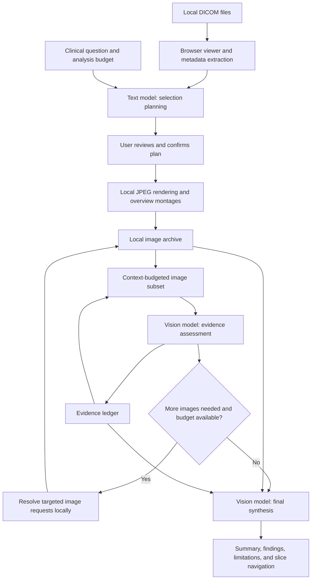

# DICOMassist

**A browser-based DICOM viewer with adaptive AI image selection**

DICOMassist turns a clinical question into a focused set of medical images for multimodal AI analysis. It combines local DICOM viewing, metadata-driven planning, and targeted image retrieval so that each request fits the selected model's image and context budgets.

Built as a portfolio and research project to demonstrate clinical workflow design and engineering for AI-assisted image review.

<p align="center">
  
</p>

<p align="center">
  <a href="https://youtu.be/fdDkg8ZleyA">Watch the demo video</a> · <a href="https://dicomassist.dev">Live demo</a> · <a href="#getting-started">Run locally</a>
</p>

> **Educational and research use only. Not for clinical use.** DICOMassist is not a certified medical device and must not be used for diagnosis or treatment decisions.

## What's changed from the original version?

The project has evolved from a two-call prototype into an adaptive analysis pipeline. This comparison uses the [original public README at commit `9e9bfe5`](https://github.com/erketellal/DICOMassist/blob/9e9bfe5/README.md) as its baseline; it describes implementation changes, not measured diagnostic improvements.

| Area | Original version | Current implementation |
| --- | --- | --- |
| Frontend | React 18 | **Vue 3**, Composition API, and TypeScript |
| AI workflow | Text planning followed by one vision call | Planning, **adaptive vision rounds**, and a separate **final synthesis** |
| Image retrieval | Series and slice ranges selected up front | Also supports **neighbouring slices, crops, corresponding native slices in another plane, and alternate renderings** |
| Analysis budget | Focused initial slice selection | **Fast, Standard, Deep analysis, and Custom** profiles with image, pixel, context, response, and refinement limits |
| Evidence tracking | Findings with slice references | **Evidence ledger** with stable local image identities across rounds; structured findings, confidence, and limitations |
| Providers | Claude and Ollama | **Claude, OpenAI, OpenRouter, Ollama, and LM Studio**, with separate planning and vision models |
| Visibility | Findings and viewer navigation | Also shows **active versus archived images, quality notices, pipeline progress, and a run comparison log** |
| Verification | Setup and feature documentation | Documented **Vitest and Playwright** checks alongside linting and production build commands |

## How it works

1. **Load a study** — Drop local DICOM files or a folder into the browser. The app extracts header metadata, groups files into series, and opens a primary series in the viewer.
2. **Ask a question** — Click **Analyze** or press **Ctrl+K / Cmd+K** and describe what to evaluate, for example: "Evaluate the ACL on this knee MRI."
3. **Review the plan** — A text model proposes series, slice ranges, sampling, display windows, and coverage goals. Adjust the plan and confirm **Analyze images** before image analysis begins.
4. **Analyze selected images** — The app renders JPEG detail images and overview montages locally. A vision model assesses the selected images and may request additional views within the remaining budget.
5. **Review the result** — A final vision call synthesizes the selected evidence into a summary, findings, confidence levels, and limitations. Slice buttons navigate back to the source images.
6. **Ask follow-ups** — Continue in the sidebar with text-only questions using conversation history and study metadata. Start a new analysis to evaluate different images.

## Key features

- **DICOM viewing** — Stack scrolling, window/level, zoom, pan, length measurement, rotate, flip, invert, and cine playback. Grid layouts and axial/coronal/sagittal MPR support multiple views.
- **Metadata-driven selection** — Series orientation is computed from DICOM direction cosines. Series metadata, MRI weighting, coverage goals, and the clinical question inform image selection.
- **Editable selection plans** — Inspect and change slice ranges, image counts, window settings, and coverage goals before confirming analysis.
- **Adaptive retrieval** — The vision model can request specific instances, neighbours, crops, alternate display settings, or corresponding slices from another native series. Duplicate renderings are skipped.
- **Evidence continuity** — A local image archive and evidence ledger preserve image identities across rounds. Each request uses a context-budgeted subset, with evidence images prioritized.
- **Visible constraints** — Image quality notices, budget estimates, archived/active image counts, and per-round logs make the pipeline inspectable.
- **Provider flexibility** — Use cloud APIs or a local model server, with credentials, endpoints, model pairs, and analysis settings retained per provider.

### Analysis profiles

Default limits come from [`src/llm/analysisConfig.ts`](src/llm/analysisConfig.ts):

| Profile | Total rendered image budget | Pixels per image | Additional vision rounds | Response token limit |
| --- | ---: | ---: | ---: | ---: |
| Fast | 8 | 786,432 | 0 | 2,048 |
| Standard | 16 | 1,150,000 | 1 | 4,096 |
| Deep analysis | 100 | 786,432 | 5 | 6,144 |
| Custom | Configurable, up to 100 | Configurable, up to 1,150,000 | 0–5 | Configurable, up to 16,384 |

These are ceilings, not guaranteed image counts. Overview montages, alternate renderings, and crops consume the image budget. Context capacity can reduce the effective image count or resolution. Archived images may appear in more than one request; the image budget does not represent total API usage across the run.

Token estimates are heuristics rather than exact provider token counts. Set the context value to the capacity actually available to the selected model or local server. Even Fast includes a separate final synthesis call.

## Getting started

### Live demo

Open [dicomassist.dev](https://dicomassist.dev). AI analysis requires your own provider configuration; you can view a study before configuring a model.

### Run locally

Use Node.js **22.12+ in the 22.x line, or 24+**, and npm. The locked Vite version also supports Node.js 20.19+.

```bash
git clone https://github.com/erketellal/DICOMassist.git
cd DICOMassist
npm ci
npm run dev
```

Open the local URL printed by Vite.

### Configure AI analysis

1. Open **Settings** in the toolbar.
2. Select a provider and enter its API key when required, or configure the local server URL.
3. Refresh the model catalogue and choose a **Planning model** and a **Vision model** that accepts images.
4. Choose an **Analysis budget** profile and check the context setting against your model/server capacity.
5. Load a study, submit a question, review the selection plan, and confirm **Analyze images**.

| Provider | Configuration | Execution |
| --- | --- | --- |
| Claude | Anthropic API key; planning and vision models | Cloud API |
| OpenAI | OpenAI API key; planning and vision models | Cloud API |
| OpenRouter | OpenRouter API key; text and image-capable models | Cloud routing service |
| Ollama | Running server, installed models, and server URL | Local when pointed at your machine |
| LM Studio | Running Developer server and loaded models; optional server token | Local when pointed at your machine |

The planning model handles selection planning and text-only follow-ups. The vision model handles image assessment and final synthesis. Available models depend on your account or server; image support must be checked for the chosen vision model.

For local servers, browser requests must be allowed by the server's CORS configuration. Ollama receives the configured context and response budgets as `num_ctx` and `num_predict`. LM Studio defaults to `http://localhost:1234/v1` in the app.

### Sample data

Use de-identified public datasets and follow their access, licence, and citation requirements:

- [DICOM Library](https://www.dicomlibrary.com) — sample DICOM studies.
- [The Cancer Imaging Archive](https://www.cancerimagingarchive.net) — research imaging collections.
- [OAI (Osteoarthritis Initiative)](https://nda.nih.gov/oai/) — knee imaging datasets.

Download a study, extract any archive, and drop the DICOM files or folder into the viewer. Keep DICOM files and patient information out of Git commits, issues, and screenshots.

### Keyboard shortcuts

| Shortcut | Action |
| --- | --- |
| Ctrl+K / Cmd+K | Open and focus the analysis sidebar after a study is loaded |
| Ctrl+B / Cmd+B | Toggle the chat sidebar |
| Escape | Cancel a pending selection plan, or close settings/the sidebar |

## Data flow and privacy

- **Local viewing:** DICOM files are parsed and rendered in the browser. The app has no application backend for storing studies, and the original DICOM files are not uploaded by the analysis pipeline.
- **Planning:** Study metadata, the clinical question, and available viewport context are sent to the configured planning provider.
- **Image analysis:** Rendered JPEGs, image labels, metadata context, and the clinical question are sent to the configured vision provider. Refinement and final synthesis can send evidence images again.
- **Follow-ups:** Conversation history and study metadata are sent to the configured text model, without new images.
- **Settings:** API keys and provider configuration are stored in the current browser's `localStorage`; they are entered at runtime and are not bundled into the build.

Cloud analysis therefore transmits image and text data to the selected provider. Local analysis stays on your machine when the configured endpoint and model server are local. DICOMassist does not provide automatic de-identification of metadata or text burned into image pixels.

## Architecture



The original two-call pattern remains the starting point: text planning followed by image assessment. The current pipeline adds bounded image retrieval and final synthesis. If final synthesis fails, the app displays the last assessment with a limitation explaining the fallback.

### Tech stack and source map

| Layer | Technology / location |
| --- | --- |
| UI and state | Vue 3 single-file components and Composition API — [`src/components`](src/components), [`src/composables`](src/composables), [`src/App.vue`](src/App.vue) |
| Language and build | TypeScript, Vite 7, Tailwind CSS 4, Lucide Vue icons |
| Medical image viewer | Cornerstone3D v4 — [`src/viewer`](src/viewer) |
| DICOM metadata and geometry | `dicom-parser` and TypeScript modules — [`src/dicom`](src/dicom) |
| Selection, export, and retrieval | Framework-neutral TypeScript — [`src/filtering`](src/filtering) |
| Providers, prompts, and orchestration | Shared service interface and Vue chat composable — [`src/llm`](src/llm) |
| Verification | ESLint, Vitest, Vue Test Utils, Playwright |

## Development and verification

```bash
npm run lint
npm run test
npm run build
npx playwright install chromium
npm run test:e2e
```

- **Unit/component tests:** DICOM geometry, slice selection, JPEG export, adaptive retrieval, evidence worksets, provider requests, structured responses, budget limits, pipeline orchestration, and Vue controls.
- **Browser tests:** Playwright/Chromium checks the landing workflow and analysis-budget settings, starting the Vite server automatically.
- **Production preview:** Run `npm run preview` after building.

These checks verify software behavior; they do not establish clinical accuracy. Implementation follow-ups are tracked in [`docs/analysis-quality-todos.md`](docs/analysis-quality-todos.md).

## Contributing

Issues and pull requests are welcome. Include reproduction steps and the relevant provider/model configuration when reporting a problem. Use de-identified examples, omit API keys and patient data, and run the relevant checks before submitting a change.

## License

[MIT](LICENSE).
